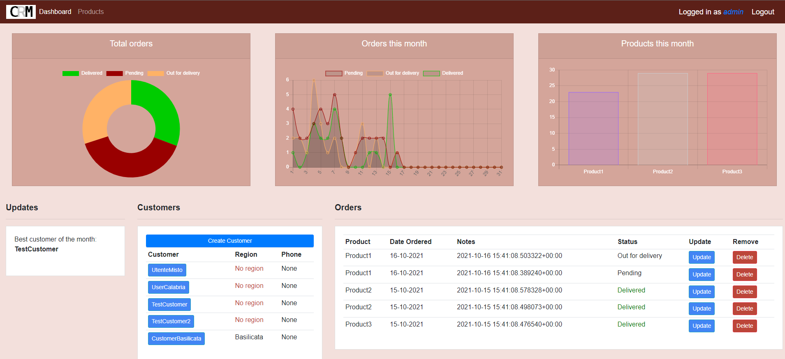

# djangocrm
:snake: A little project to create a CRM web application with [Django](https://www.djangoproject.com/) using [Dennis Ivy](https://github.com/divanov11)'s [YouTube tutorial](https://youtube.com/playlist?list=PL-51WBLyFTg2vW-_6XBoUpE7vpmoR3ztO).

I added the following features:
* Users can be added by both admin and with self-sign-up
* Internal agents can be assigned to a specific Region (aka a User Group), so the dashboard will filter products, customers and orders coming only from the  selected Region
* The total amounts on the status bar were replaced with status charts
* An Updates table in the dashboard showing the customer with most orders

Last screenshot:

Tech stack:

## :pushpin: To do
### Bugfixes/Partial
- [ ] Fix the problem with deleting the user's profile pic in the user profile page
- [ ] Fix the DateTime format (European?) in the order filter in the Customer page: **update** almost there, but the orders included in the EndDate are filtered away (because >= 'EndDate 00:00:00', the filters need to be improved)
- [ ] Fix the Update_order view with OrderFormSet instead of Form
- [ ] Test the Reset Password features with another email
### Features
- [ ] Add a `clear-orders.py` function in `management\commands`
- [ ] Keep the CreateCustomer button on the dashboard, or restrict the customer's creation permission to admin?
- [ ] Move the JS scripts (mostly the charts in the dashboard) to a separate file, still keeping the Django template tags
- [ ] Add a [choropleth map](https://github.com/sgratzl/chartjs-chart-geo) divided by Region in the dashboard
- [ ] Internationalization (it/en)
- [ ] Add the "Region" property to the customers and to the users, and then make the user see only the customers from the assigned region. The solution with User Groups described below is just a workaround.
- [ ] Customize the Admin panel
- [ ] Add a [chatbot](https://www.datacamp.com/community/tutorials/building-a-chatbot-using-chatterbot) for customer's support - visible only on the customer's own page
- [ ] Integrate Google APIs (like Maps to get the customer's address)?

#### Regarding user auth
* Administrators must be given the `is_superuser` property: these users can be created and updated only from the Django admin panel
* There are several user Groups, each one for each region: by adding users in these Groups (Django allows the many-to-many relationship between users and groups), they will be able to see only the customers coming from the corresponding regions and their orders. These users also can be created only from the Django admin panel.
* The last special user Group is called `Customers`: they can only view their profile page, containing their orders. These user are automatically created during user registration. A corresponding Customer is created with the same name and email as the user.
* To filter users depending on their associated groups, you can use a [custom template tag](https://docs.djangoproject.com/en/1.11/howto/custom-template-tags/). In this case we created a [`has_group.py`](./accounts/templatetags/has_group.py) file, which then needs to be loaded with the `` tag in the HTML template requiring it. A better description can be found in [this Stackoverflow post](https://stackoverflow.com/questions/34571880/how-to-check-in-template-if-user-belongs-to-a-group).

### About graphics
* Charts were rendered with [Chart.js](https://www.chartjs.org/docs/latest/)
* Color palettes are inspired by [this list of color schemes for websites](https://visme.co/blog/website-color-schemes/), e.g. n.19 and n.35

## Next
* :whale: [Dockerize the project](https://docs.docker.com/samples/django/)!
* :ocean: Deploy on [Azure Web App](https://docs.microsoft.com/en-us/azure/app-service/tutorial-python-postgresql-app?tabs=bash%2Cclone&pivots=postgres-single-server), also with [this tutorial](https://docs.microsoft.com/en-us/learn/modules/django-deployment/)
* :toolbox: Deploy on [ACS](https://docs.microsoft.com/en-us/azure/container-instances/container-instances-using-azure-container-registry)
* :door: [CI/CD](https://youtube.com/playlist?list=PLOLrQ9Pn6caxeUIXRVOZpDJ_2PbGAa_Io)!
